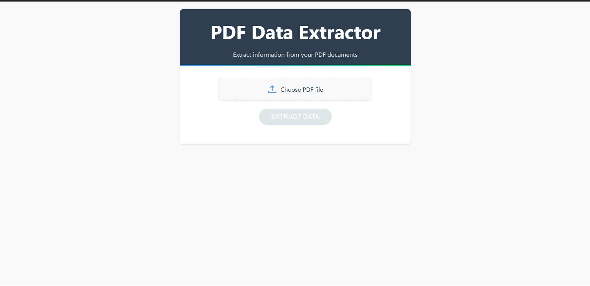
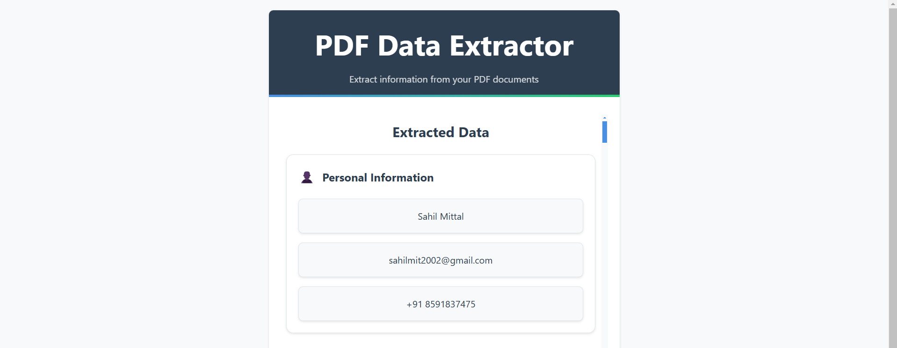

# PDF Extractor 📄

A powerful web application for extracting and analyzing text from PDF files, built with React and Node.js.


## ✨ Features

- 📤 Easy PDF file upload and processing
- 📝 Accurate text extraction from PDF documents
- 🎨 Modern, user-friendly interface
- 🔒 Secure file handling
- ⬇️ Download extracted text
- 🔍 Search within extracted text
- 📱 Responsive design for all devices

## 🛠️ Tech Stack

### Frontend
- React.js
- Material-UI
- Axios
- PDF.js

### Backend
- Node.js
- Express.js
- Multer
- pdf-parse

## 🚀 Installation

### Prerequisites
- Node.js (v14 or higher)
- npm or yarn
- Git

### Setup Instructions

1. **Clone the repository**
   ```bash
   git clone https://github.com/SazzHub221/pdf-extractor.git
   cd pdf-extractor
   ```

2. **Install Backend Dependencies**
   ```bash
   cd backend
   npm install
   ```

3. **Install Frontend Dependencies**
   ```bash
   cd frontend
   npm install
   ```


## 💻 Running the Application

1. **Start the Backend Server**
   ```bash
   cd backend
   npm start
   ```

2. **Start the Frontend Development Server**
   ```bash
   cd frontend
   npm start
   ```

Visit `http://localhost:3000` in your browser to use the application.

## 🔗 API Endpoints

| Method | Endpoint | Description |
|--------|----------|-------------|
| POST | `/api/upload` | Upload PDF file |
| GET | `/api/extract/:fileId` | Extract text from PDF |
| GET | `/api/files` | Get uploaded files list |
| DELETE | `/api/files/:fileId` | Delete a file |

## 📸 Screenshots

<div align="center">
  
  
</div>

## 🤝 Contributing

We welcome contributions! Please follow these steps:

1. Fork the repository
2. Create your feature branch
   ```bash
   git checkout -b feature/AmazingFeature
   ```
3. Commit your changes
   ```bash
   git commit -m 'Add some AmazingFeature'
   ```
4. Push to the branch
   ```bash
   git push origin feature/AmazingFeature
   ```
5. Open a Pull Request

## 📝 License

This project is licensed under the MIT License - see the [LICENSE](LICENSE) file for details.

## 📞 Contact

Your Name - [sahilmit2002@gmail.com](mailto:sahilmit2002@gmail.com)

Project Link: [https://github.com/SazzHub221/pdf-extractor](https://github.com/SazzHub221/pdf-extractor)

## 🙏 Acknowledgments

- [pdf-parse](https://www.npmjs.com/package/pdf-parse) for PDF processing
- [React](https://reactjs.org/) for the frontend framework
- [Material-UI](https://material-ui.com/) for the UI components
- All our contributors and supporters

---

<div align="center">
  Made with ❤️ by [Sahil Mittal]
</div>
